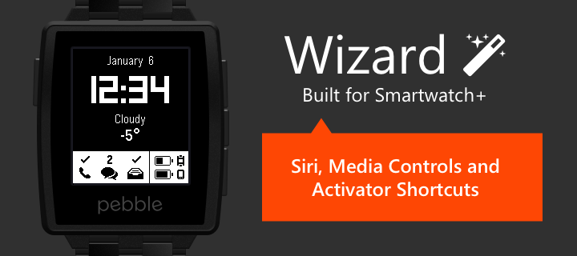

#Wizard Watch App

Based on Robert Hesse's illustrious SmartStatus watch app, Wizard brings an elegant and minimalist design with Siri, media controls, Activator actions, and translations for English, French, German and Spanish

_Smartwatch+ (Cydia) required. Will **NOT** work with the App Store version._

####Controls

* Launch Siri: _Press top button_
* Next Screen: _Press select button_
* Refresh Data: _Press bottom button_
* Show Battery Info: _Shake / Tap_

####Media Controls

* Previous Track: _Hold top button_
* Play / Pause: _Hold select button_
* Next Track: _Hold bottom button_

####Activator Actions

Double clicking a button will trigger the action assigned to "Press `x` button" in the Activator screen of Smartwatch+. Triple clicking a button will trigger the action assigned to "Hold `x` button". Activator actions must be configured in the Smartwatch+ app.

####Languages

- [x] English
- [x] German
- [x] French
- [x] Dutch (translated but currently unsupported by Pebble's firmware)
- [ ] Spanish

I don’t have plans to translate beyond the languages mentioned above. If you’d like to submit a translation, download _resources/locales/locale_english.json_ to use as a template.
